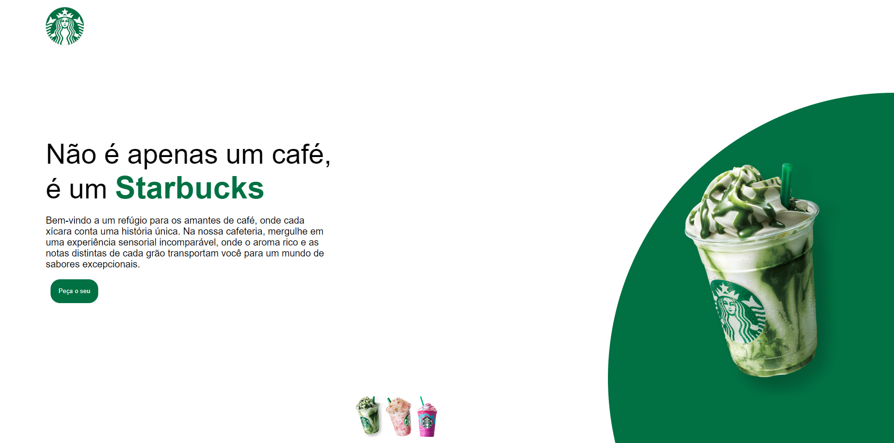
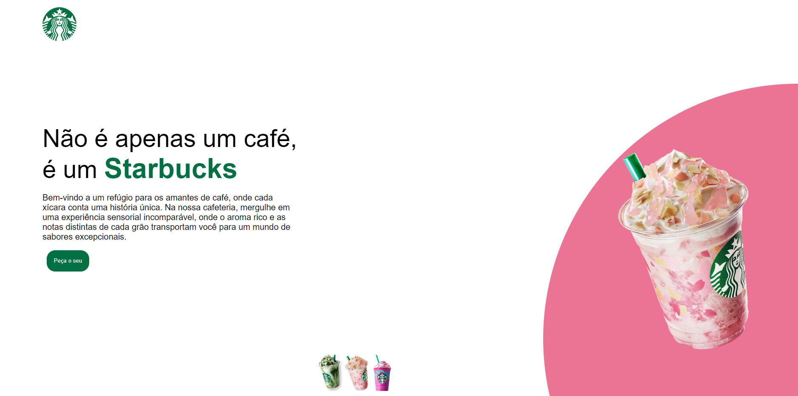
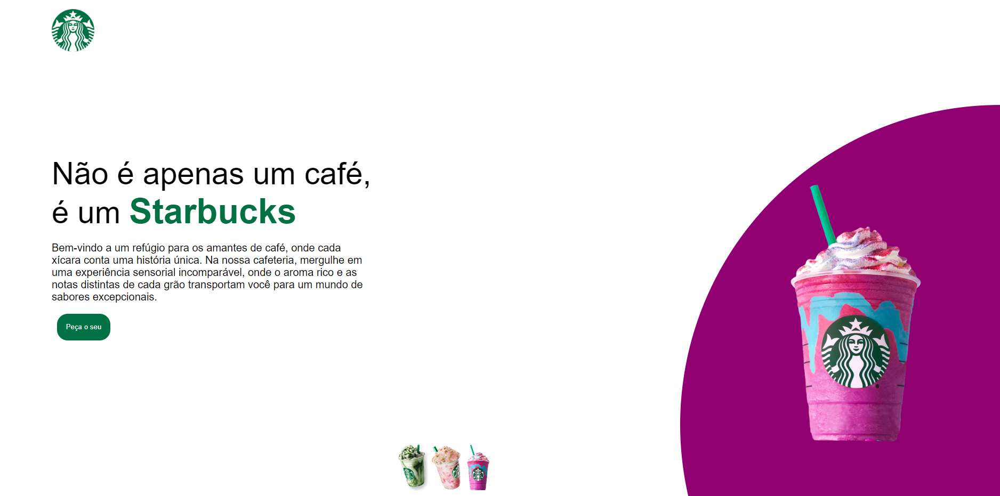

<h1>Projeto Starbucks</h1>
 
<h2>Linguagens usadas:</h2>
 
<ul>

 

 

</ul>
 

Página começa com o seguinte layout: 

 
 

Clicando no copo do meio, o site se encontrará desta forma: 

 
 

Por fim, clicando no copo rosa-choque, o que se encontra a direita, a página se encontrará de outra forma: 

